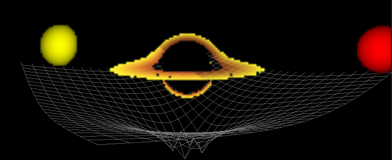

# 🕳️ Black Hole Simulation

<table>
  <tr>
    <td align="center" width="50%">
      
      <br>
      <sub><b>Figure 1:</b> High-resolution static view of gravitational lensing and the accretion disk.</sub>
    </td>
    <td align="center" width="50%">
      
      <br>
      <sub><b>Figure 2:</b> Real-time animation demonstrating spacetime curvature and movement.</sub>
    </td>
  </tr>
</table>

A high-performance C++ and OpenGL implementation of a Schwarzschild Black Hole simulation. This project features real-time ray tracing (using Compute Shaders) to accurately visualize gravitational lensing, accretion disks, and spacetime curvature.
## **✨ Features**

* **🔭 Gravitational Lensing:** Simulates the bending of light around a massive object using general relativity equations.
* **🌪️ Accretion Disk:** Visualizes the swirling matter around the event horizon, including the Doppler beaming effect.
* **🌐 Spacetime Curvature:** Includes a grid visualization to demonstrate the "gravity well" distortion of spacetime.
* **🚀 GPU Acceleration:** Utilizes OpenGL Compute Shaders (`geodesic.comp`) to solve geodesic equations in real-time.

## **🎮 Controls**

| Input | Action |
| :--- | :--- |
| **🖱️ Left Mouse / Middle Mouse** | Orbit Camera |
| **📜 Scroll Wheel** | Zoom In / Out |
| **⌨️ G** | Toggle Gravity (affects massive objects) |

## **🛠️ Building Requirements**

1.  **💻 C++ Compiler** (C++ 17 or newer)
2.  **🔨 [CMake](https://cmake.org/)** (Build system)
3.  **📦 [Vcpkg](https://vcpkg.io/en/)** (Package manager)
4.  **🐙 [Git](https://git-scm.com/)**

## **🏗️ Build Instructions**

### **🪟 1. Windows (Recommended via Vcpkg)**

1.  **📥 Clone the repository:**
    ```bash
    git clone https://github.com/Pradhuman19/Black-Hole-Simulation
    cd BlackHoleSim
    ```

2.  **📦 Install dependencies:**
    ```bash
    vcpkg install
    ```

3.  **⚙️ Configure the project:**
    *Run this command to integrate vcpkg and configure CMake:*
    ```bash
    vcpkg integrate install
    # Copy the toolchain path from the output above if it differs
    cmake -B build -S . -DCMAKE_TOOLCHAIN_FILE=[path/to/vcpkg]/scripts/buildsystems/vcpkg.cmake
    ```

4.  **🧱 Build:**
    ```bash
    cmake --build build
    ```

5.  **▶️ Run:**
    The executable `BlackHole3D.exe` will be located in the `build/` (or `build/Debug/`) folder.

### **🐧 2. Linux (Debian/Ubuntu)**

If you prefer using native system packages instead of Vcpkg:

1.  **📦 Install development packages:**
    ```bash
    sudo apt update
    sudo apt install build-essential cmake libglew-dev libglfw3-dev libglm-dev libgl1-mesa-dev
    ```

2.  **🧱 Build:**
    ```bash
    cmake -B build -S .
    cmake --build build
    ```

## **🧠 How It Works**

* **📐 2D Simulation (`2D_lensing.cpp`):** A simplified CPU-based demonstration of gravitational lensing effects on a 2D plane.
* **🌌 3D Simulation (`black_hole.cpp`):** A full-scale simulation that offloads heavy math to the GPU. It uploads scene data (camera, star positions, disk parameters) to a **Uniform Buffer Object (UBO)**. The **Compute Shader (`geodesic.comp`)** then performs Ray-Marching using the Runge-Kutta 4 (RK4) method to trace light paths through curved spacetime.

---
